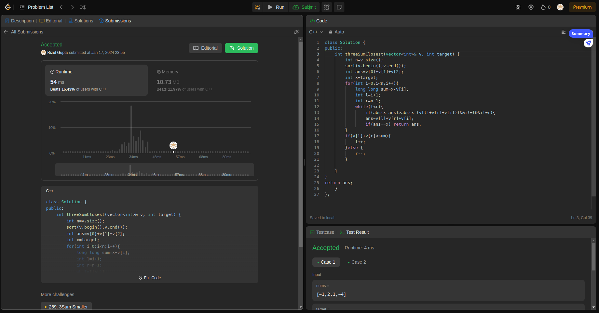

## Question-3 (3-Sum Closest)

- **Submission Link:** [LeetCode Submission](https://leetcode.com/problems/3sum-closest/submissions/1149059401)
- **Status:** Passed all test cases
- **Time Complexity:** O(n^2)
- **Space Complexity:** O(1)
- **Explanation:** First sort the given vector and then iterate over the vector we get a new target sum i.e target-current value ,now we use the two pointer approach to get the closest possible value to the new target and keep updating the answer when the absolute diiference of answer is greater than the current totalsum i.e. newtarget + current value.
  
