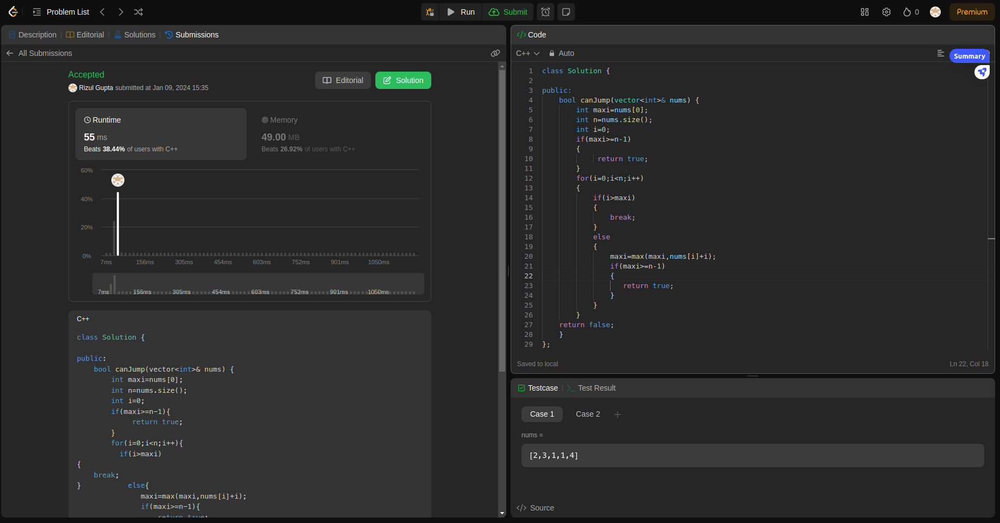

## Question-4 (Jump-Game)

- **Submission Link:** [LeetCode Submission](https://leetcode.com/problems/jump-game/submissions/1141328105)
- **Status:** Passed all test cases
- **Time Complexity:** O(n)
- **Space Complexity:** O(1)
- **Explanation:** The algorithm maintains a variable, maxi, representing the maximum reachable index from the current position. It starts from the first element of the array, iterates through each element, and updates maxi to be the maximum of its current value and the sum of the current element's value and its index. The loop breaks if the iteration exceeds the current maxi, indicating that further progress is not possible. After the loop, the code checks if the updated maxi is greater than or equal to the last index of the array. If true, it returns true, indicating that reaching the end is possible; otherwise, it returns false.
  